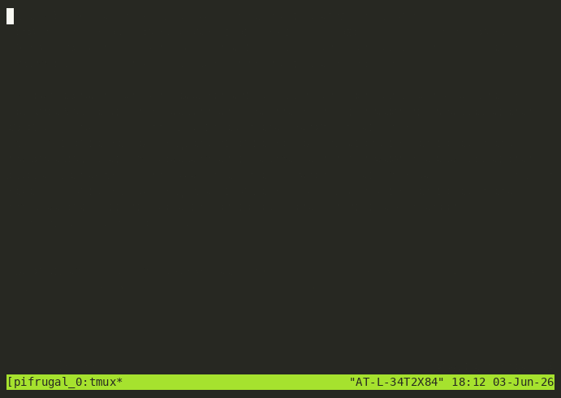

# pi-frugal



**A lean, cost-aware [pi](https://pi.dev) setup** — tiered model routing, live AiCredits visibility, and a thin Atlassian (Jira / Confluence / Bitbucket / Requirements Yogi) overlay. Designed to give you the productivity of obra/superpowers + the API reach of sriluxman/atlassian-skills (with Requirements Yogi support), without the per-turn token bloat of MCP servers or one-model-for-everything defaults.

---

## What you get

| Piece | Type | Purpose |
|---|---|---|
| **tier-router** | extension | Auto-picks **Haiku** (retrieval/lookup), **Sonnet** (design/brainstorming), or **Opus** (essential implementation) per prompt. Explicit `,haiku` / `,sonnet` / `,opus` overrides; `/route off` to disable. Conservative: ambiguous prompts default to Opus, never silently downgrades, honours user model pins. |
| **aicredits-footer** | extension | Replaces pi's default USD footer with **AiCredits** computed from your real billing rates. Per-session totals shown live as `↑in R cacheRead W cacheWrite ↓out C credits`. Rates fully overridable via `AICREDITS_RATES` env. |
| **atlassian** (overlay) | skill | Thin (~250 line) overlay that tells the agent how to invoke `sriluxman/atlassian-skills` (Jira/Confluence/Bitbucket/Requirements Yogi) from inside pi, with a `<HARD-GATE>` around every mutating call. Credentials live in `~/.pi/agent/secrets/atlassian.env` (chmod 600) — never in the repo. |

### What you don't get

- No MCP servers running in the background
- No vendored copies of upstream skills (composes cleanly, you own updates)
- No PATs or company-specific URLs in the package

---

## Install (2 commands)

```bash
# 1. install pi-frugal itself
pi install git:github.com/sriluxman/pi-frugal

# 2. one-shot setup: pulls upstream skill packs, prompts for Atlassian PATs, verifies auth
bash ~/.pi/agent/git/github.com/sriluxman/pi-frugal/scripts/setup.sh
```

That's it. The footer shows your credit spend live; the tier router picks the model per prompt.

### Setup flags

```bash
bash .../scripts/setup.sh --no-creds    # skip the Atlassian PAT prompts (configure later)
bash .../scripts/setup.sh --no-verify   # skip the post-install Jira verification call
```

The individual sub-scripts (`install-deps.sh`, `setup-atlassian.sh`, `verify-atlassian.sh`)
are still there and idempotent — call them directly if you only want one step (e.g. to
rotate a PAT: `bash .../scripts/setup-atlassian.sh`).

### Try without installing

```bash
git clone https://github.com/sriluxman/pi-frugal
pi -e ./pi-frugal   # loads for this run only
```

---

## Configuration

All configuration is via env vars — no config files to edit in the package.

### AiCredits rates (override the defaults to match your billing)

```bash
export AICREDITS_RATES='{
  "claude-opus-4.7":   {"input":500, "cacheRead":50, "cacheWrite":625, "output":2500},
  "claude-sonnet-4.6": {"input":150, "cacheRead":15, "cacheWrite":188, "output":750},
  "claude-haiku-4.5":  {"input":80,  "cacheRead":8,  "cacheWrite":100, "output":400}
}'
```

Defaults shipped with the package are reasonable for github-copilot's Claude offerings — verify against your provider's actual rates.

### Tier-router model IDs (override if you use a different provider)

```bash
export TIER_ROUTER_MODELS='{
  "provider": "anthropic",
  "models": {"haiku":"claude-haiku-4-5", "sonnet":"claude-sonnet-4-6", "opus":"claude-opus-4-7"}
}'
```

### Tier-router thinking levels (clamp to what your provider supports)

github-copilot's Anthropic models currently only accept `off` or `medium`:

```bash
export TIER_ROUTER_THINKING='{"haiku":"off", "sonnet":"medium", "opus":"medium"}'
```

If your provider supports more (e.g. direct Anthropic): use `minimal` / `low` / `high` / `xhigh`.

### Atlassian paths (override if you put scripts/creds elsewhere)

| Env | Default |
|---|---|
| `PI_FRUGAL_ATLASSIAN_DIR` | `~/.pi/agent/git/github.com/sriluxman/atlassian-skills/atlassian-skills` |
| `PI_FRUGAL_ATLASSIAN_ENV` | `~/.pi/agent/secrets/atlassian.env` |
| `PI_FRUGAL_ATLASSIAN_PY` | `<dir>/.venv/bin/python` |

---

## Commands available inside pi

| Command | Effect |
|---|---|
| `/route` or `/route show` | Show router mode, last decision, current model, tier map, thinking-per-tier |
| `/route off` / `/route auto` | Disable / re-enable auto-routing |
| `/route haiku\|sonnet\|opus` | One-shot: force next prompt to that tier |
| `,haiku ...` / `,sonnet ...` / `,opus ...` | Inline override per prompt (prefix stripped). We use `,` not `!` because pi reserves `!` for shell-out. |
| `/credits-footer` | Toggle the AiCredits footer |
| `/credits-rates` | Show the rate table currently in use |

---

## Why this exists — the cost story

Origin: replacing a heavy `opencode + MCP + Copilot` setup that paid for ~5 K tokens of always-on tool schemas on every turn, plus Opus pricing on every prompt regardless of how trivial.

After this package:

| Lever | Before | After | Net |
|---|---|---|---|
| Per-turn harness baseline (Atlassian tooling) | ~5 K tokens MCP schemas always loaded | ~150 tokens (thin overlay) | ~33× lower |
| Per-prompt model selection | Opus on everything | Haiku/Sonnet/Opus auto-routed | ~2.7× cheaper blended |
| Cost visibility | USD from generic price table | AiCredits from your real rates, live | actionable |

See [docs/design.md](docs/design.md) for the full design rationale.

---

## Security

- The package **never bundles secrets**. The only `.env` in the repo is `.env.example` with placeholders.
- `setup-atlassian.sh` writes `~/.pi/agent/secrets/atlassian.env` with mode `0600` in a `0700` parent directory.
- `verify-atlassian.sh` fixes the mode if it drifted.
- `.gitignore` blocks `.env`, `*.env`, and `secrets/` from ever being committed.
- The atlassian overlay carries a `<HARD-GATE>` that the agent must respect: every mutating call (create / update / delete / transition / merge / etc.) requires explicit user approval in-message before execution.

### Recommended additions

- Use a **scoped PAT** (read + write to the specific projects you need, not org-wide).
- Rotate the PAT periodically; `setup-atlassian.sh` is safe to re-run.

---

## Composes with (not bundled)

- [obra/superpowers](https://github.com/obra/superpowers) — 14 productivity skills (brainstorming, writing-plans, systematic-debugging, verification-before-completion, …)
- [mattpocock/skills](https://github.com/mattpocock/skills) — productivity bundle (grill-me, grilling, handoff, teach, writing-great-skills) + engineering bundle (tdd, codebase-design, diagnosing-bugs, triage, prototype, to-prd, to-issues, improve-codebase-architecture, …)
- [sriluxman/atlassian-skills](https://github.com/sriluxman/atlassian-skills) — Python toolkit with Requirements Yogi support: 45+ functions across Jira / Confluence / Bitbucket / Requirements Yogi

Both are installed via `pi install` and stay current with their upstream.

---

## License

MIT — see [LICENSE](LICENSE).
